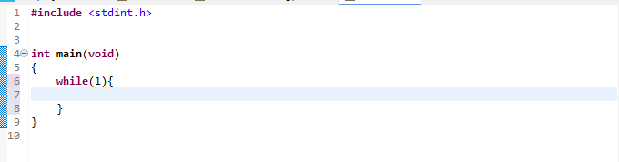
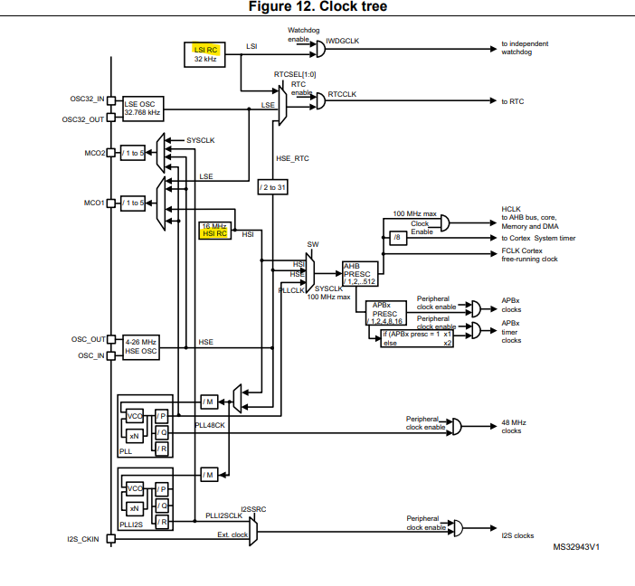
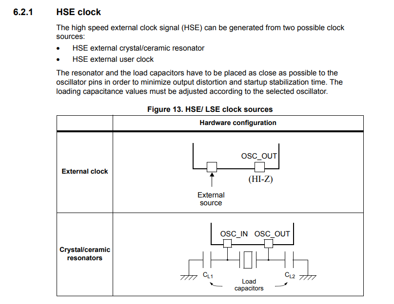
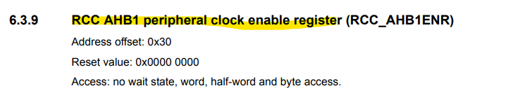
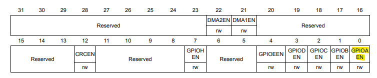
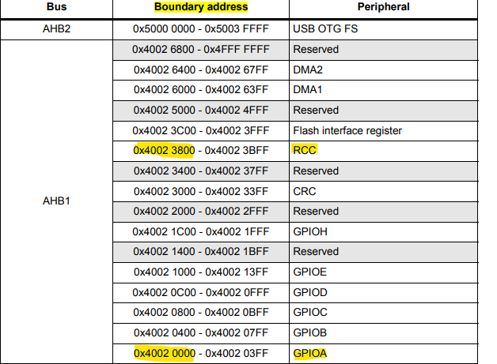
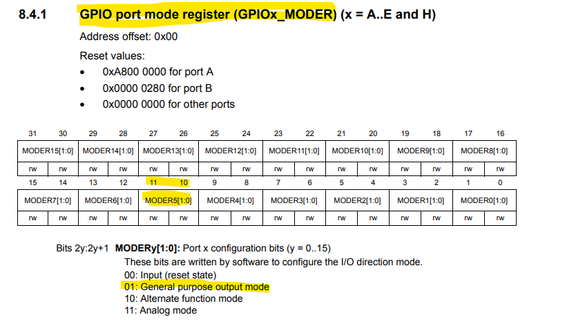
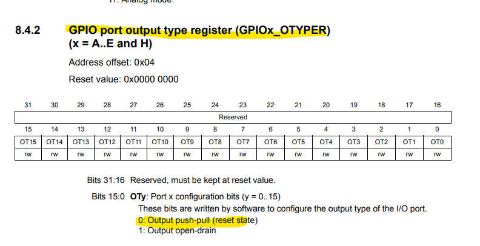

# 찐 바텀부터 설계하기
초기 화면  
  


아래 순서대로 만들 것  
```c
#include <stdint.h>


int main(void)
{
	/*1. Enable clock access to GPIOA */

	/*2. Set PA5 as output pin*/
	
	while(1){
		/*3. Set PA5 high*/

		/*4. Set PA5 low*/
	}
}

```


1. RCC가 GPIOA에 CLK을 공급해 주어야 함

**clock tree**  
  
- 내부 CLOCK
    내부 CLOCK은 온도나 주변환경에 따라 CLOCK 이 변하기도 한다
    - HSI (High Speed Internal Clock)    
        system 동작 위한 CLOCK

    - LSI (Low Speed Internal Clock)  
        RTC 내부 CLOCK   


- 외부 CLOCK
      
    내부 CLOCK에 비해 CLOCK 이 정확


  
  
GPIOAEN 를 1로 설정해주면 GPIOA에 CLOCK을 넣어주는 것

**Register map**  
  

**RTC 설정 코드**
RCC base addr: 0x4002 3800  
AHB1 en clock register에 접근하기 위한 offset : 0x30  
-> 0x4002 3830  
```c
	/*1. Enable clock access to GPIOA */
    *(volatile uint32_t *)0x40023830 |= (1U <<0); 
```

2. GPIO Reigster 설정
**GPIO mode Reg**  
  
- Reg addr: `0x40002000`
- Reg value: `mode[11:10] = 2'b01`

**GPIO output type reg**  
  
default 값은 push-pull -> 별도 설정 필요 X

**GPIO Reg 설정 코드**

```c
	/*2. Set PA5 as output pin*/
    *(volatile uint32_t *)0x40002000 |= (1U << 10);
    *(volatile uint32_t *)0x40002000 &= ~(1U << 11);
```

<details>
<summary> 1U </summary>

`1U`는 `unsigned int`를 의미

</details>