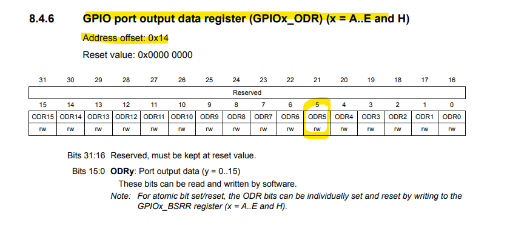
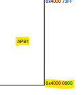

# 찐 바텀부터 설계하기
초기 화면  
  


아래 순서대로 만들 것  
```c
#include <stdint.h>


int main(void)
{
	/*1. Enable clock access to GPIOA */

	/*2. Set PA5 as output pin*/
	
	while(1){
		/*3. Set PA5 high*/

		/*4. Set PA5 low*/
	}
}

```


1. RCC가 GPIOA에 CLK을 공급해 주어야 함

**clock tree**  
  
- 내부 CLOCK
    내부 CLOCK은 온도나 주변환경에 따라 CLOCK 이 변하기도 한다
    - HSI (High Speed Internal Clock)    
        system 동작 위한 CLOCK

    - LSI (Low Speed Internal Clock)  
        RTC 내부 CLOCK   


- 외부 CLOCK
      
    내부 CLOCK에 비해 CLOCK 이 정확


  
  
GPIOAEN 를 1로 설정해주면 GPIOA에 CLOCK을 넣어주는 것

**Register map**  
  

**RTC 설정 코드**
RCC base addr: 0x4002 3800  
AHB1 en clock register에 접근하기 위한 offset : 0x30  
-> 0x4002 3830  
```c
	/*1. Enable clock access to GPIOA */
    *(volatile uint32_t *)0x40023830 |= (1U <<0); 
```

2. GPIO Reigster 설정
**GPIO mode Reg**  
  
- Reg addr: `0x40002000`
- Reg value: `mode[11:10] = 2'b01`

**GPIO output type reg**  
  
default 값은 push-pull -> 별도 설정 필요 X

**GPIO Reg 설정 코드**

```c
	/*2. Set PA5 as output pin*/
    *(volatile uint32_t *)0x40020000 |= (1U << 10);
    *(volatile uint32_t *)0x40020000 &= ~(1U << 11);
```

<details>
<summary> 1U </summary>

`1U`는 `unsigned int`를 의미

</details>

3. PA5 LED를 Toggle
  
```c
    //high
    *(volatile uint32_t *)0x40020014 |= (1U << 5);
    for(int i=0; i<100000;i++){}
    //low
    *(volatile uint32_t *)0x40020014 &= ~(1U << 5);
    for(int i=0; i<100000;i++){}
```


### 전체 코드

```c
#include <stdint.h>

int main(void)
{
   /*1. Enable clock access to GPIOA */
   // RCC clock control
   *(volatile uint32_t *)0x40023830 |= (1U << 0); // RCC AHB1ENR

   /*2. Set PA5 as output pin */
   *(volatile uint32_t *)0x40020000 |= (1U << 10);// GPIOA_MODER output mode
   *(volatile uint32_t *)0x40020000 &= ~(1U << 11);// GPIOA_MODER output mode

   //for(;;);
   while(1)
   {
      /*3. Set PA5 high */
      *(volatile uint32_t *)0x40020014 |= (1U <<5);
      for(int i = 0; i<100000; i++){}
      /*4. Set PA5 low */
      *(volatile uint32_t *)0x40020014 &= ~(1U <<5);
      for(int i = 0; i<100000; i++){}
   }
}
```

### define을 이용해서 가독성 좋게 바꾸기
[](./gpio_v00.c)  

### 좀 더 코드를 범용적으로 설계하자
GPIOA 만 사용하는 것이 아닌 GPIO에 관련되어 모두 적용할 수 있도록 범용적으로 설계하자   

AHB1의 base addr : 0x40000000



```c
#define PHERIPH_BASE (0x40000000UL)
#define APB1PERIPH_OFFSET (0x00000UL)
#define APB2PERIPH_OFFSET (0x10000UL)
#define AHB1PERIPH_OFFSET (0x20000UL)

#define APB1PERIPH_BASE (PERIPH_BASE + APB1PERIPH_OFFSET)
#define APB2PERIPH_BASE (PERIPH_BASE + APB2PERIPH_OFFSET)
#define AHB1PERIPH_BASE (PERIPH_BASE + AHB1PERIPH_OFFSET)
```


### 구조체 사용의 중요성 알기
```c
/*구조체 사용의 중요성 알기*/
//구조체 쓰기 전
#define GPIOA_MODER   *(volatile uint32_t *)(GPIOA_BASE + 0x00)
#define GPIOA_OTYPER  *(volatile uint32_t *)(GPIOA_BASE + 0x04)
#define GPIOA_OSPEEDR *(volatile uint32_t *)(GPIOA_BASE + 0x08)
#define GPIOA_PUPDR   *(volatile uint32_t *)(GPIOA_BASE + 0x0C)
#define GPIOA_IDR     *(volatile uint32_t *)(GPIOA_BASE + 0x10)
#define GPIOA_ODR     *(volatile uint32_t *)(GPIOA_BASE + 0x14)
#define GPIOA_BSRR    *(volatile uint32_t *)(GPIOA_BASE + 0x18)
#define GPIOA_LCKR    *(volatile uint32_t *)(GPIOA_BASE + 0x1C)
#define GPIOA_AFRL    *(volatile uint32_t *)(GPIOA_BASE + 0x20)
#define GPIOA_AFRH    *(volatile uint32_t *)(GPIOA_BASE + 0x24)

#define GPIOB_MODER   *(volatile uint32_t *)(GPIOB_BASE + 0x00)
#define GPIOB_OTYPER  *(volatile uint32_t *)(GPIOB_BASE + 0x04)
#define GPIOB_OSPEEDR *(volatile uint32_t *)(GPIOB_BASE + 0x08)
#define GPIOB_PUPDR   *(volatile uint32_t *)(GPIOB_BASE + 0x0C)
#define GPIOB_IDR     *(volatile uint32_t *)(GPIOB_BASE + 0x10)
#define GPIOB_ODR     *(volatile uint32_t *)(GPIOB_BASE + 0x14)
#define GPIOB_BSRR    *(volatile uint32_t *)(GPIOB_BASE + 0x18)
#define GPIOB_LCKR    *(volatile uint32_t *)(GPIOB_BASE + 0x1C)
#define GPIOB_AFRL    *(volatile uint32_t *)(GPIOB_BASE + 0x20)
#define GPIOB_AFRH    *(volatile uint32_t *)(GPIOB_BASE + 0x24)
/*구조체 사용의 중요성 알기*/
```

> 구조체로 바꾸기

```c
/*구조체 사용 후*/
typedef struct{
   volatile uint32_t MODER;
   volatile uint32_t OTYPER;
   volatile uint32_t OSPEEDR;
   volatile uint32_t PUPDR;
   volatile uint32_t IDR;
   volatile uint32_t ODR;
   volatile uint32_t BSRR;
   volatile uint32_t LCKR;
   volatile uint32_t AFR[2]; //배열로 AFRL, AFRH 나타내기
}GPIO_TypeDef;
```