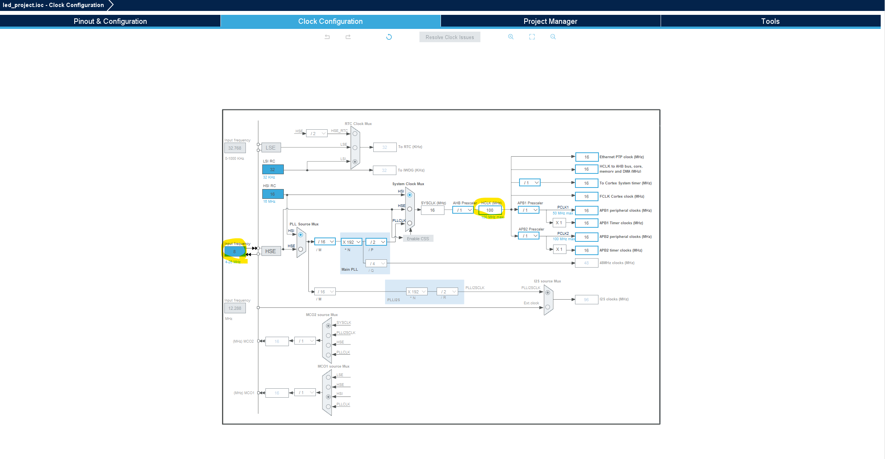

# STM32 project 생성
우리가 사용하는 보드
  
**6 High-performance access line, Arm Cortex-M4 core with DSP and FPU, 512 Kbytes of Flash memory, 100 MHz CPU, ART Accelerator**

- 사용하는 보드 스펙은 정확히 알고 가자
"512KB Flash Memory, 127KB RAM, 100MHz CPU"

**F411RE_MCU**

처음에 클럭을 설정해주어야 한다.
  
RCC는 전부 clk 관련된 peripheral 모아둔 것  

아래와 같이 입력해준다
  