# STM32 project 생성
우리가 사용하는 보드
  
**6 High-performance access line, Arm Cortex-M4 core with DSP and FPU, 512 Kbytes of Flash memory, 100 MHz CPU, ART Accelerator**

- 사용하는 보드 스펙은 정확히 알고 가자
"512KB Flash Memory, 127KB RAM, 100MHz CPU"

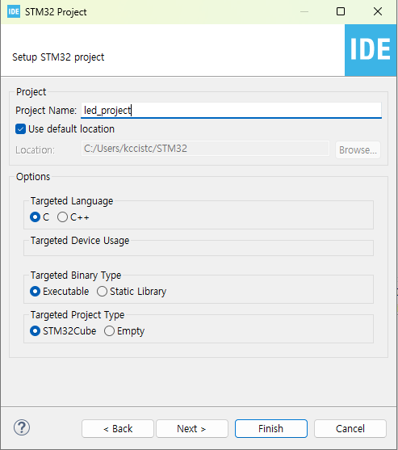

## F411RE_MCU**
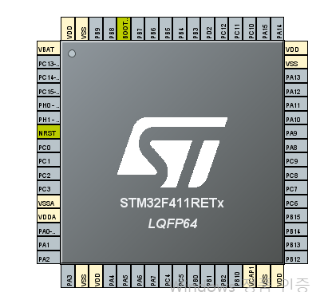

### RCC
처음에 클럭을 설정해주어야 한다.
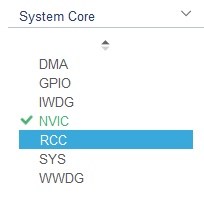  
RCC는 전부 clk 관련된 peripheral 모아둔 것  

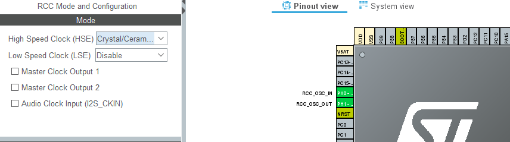

아래와 같이 입력해준다
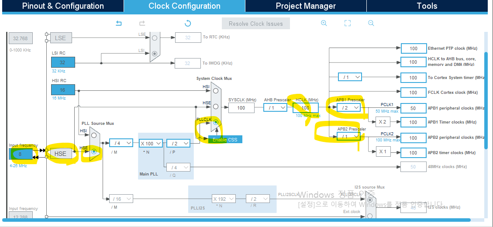

### SYS
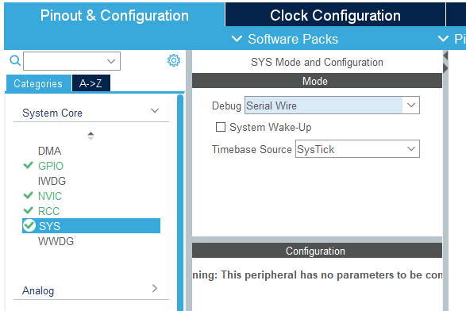  
디버깅을 도와줌

## LED
User LD2: 사용자가 맘대로 쓸 수 있는 LED
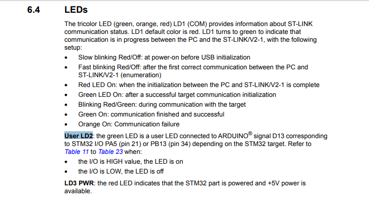

PA5 or PB13에 LED가 연결되어 있으며 High 일 때 LED ON, LOW 일 때 OFF

**schematic의 LD2**  
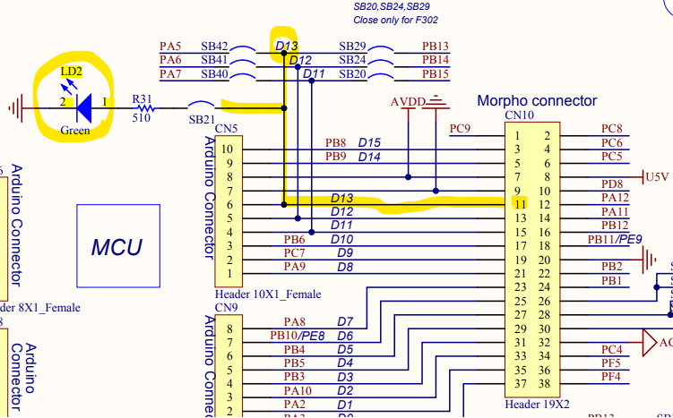
LD2는 PA5(D13)에 default 로 연결되어 있다.  

**pin map**  
아래 그림은 계속 필요하다. 따로 저장할 것  
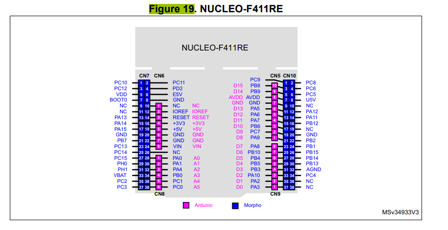

**PA5** 에 LD2 연결되어있음  
pin map 에서 확인해보면 같은 행끼리 wire 연결되어 short되어 있음을 확인 가능. 암/수 만 다르다.  

PA5 -> GPIO Output 으로 설정하자  
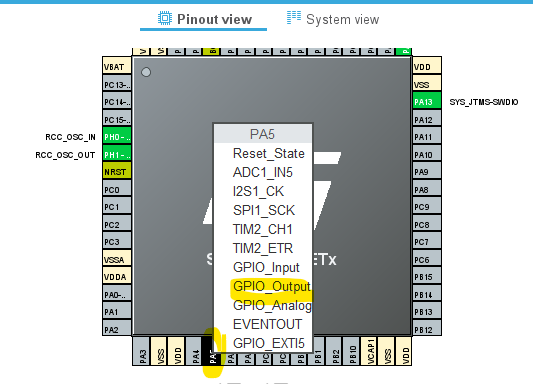  

GPIO 눌러보면 잘 설정되어있음을 확인가능  
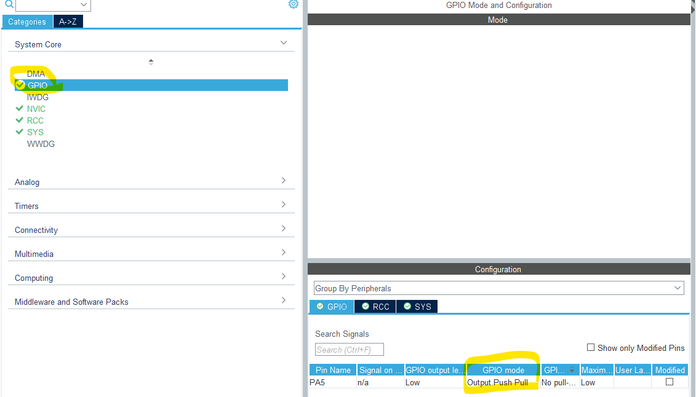

- Push Pull/ Open Drain 차이  
<---------------------------------->

