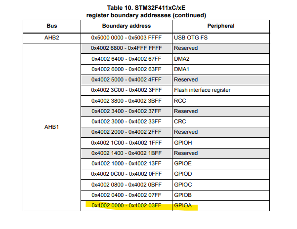
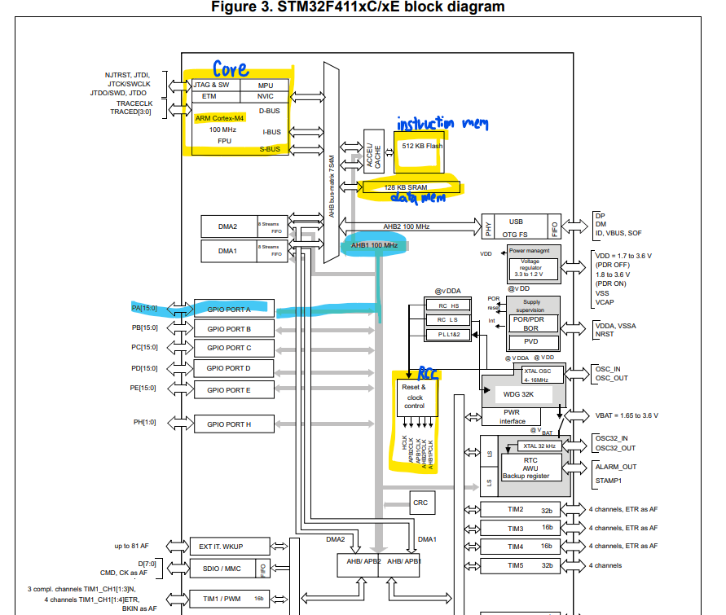

# STM32 project 생성
우리가 사용하는 보드
  
**6 High-performance access line, Arm Cortex-M4 core with DSP and FPU, 512 Kbytes of Flash memory, 100 MHz CPU, ART Accelerator**

- 사용하는 보드 스펙은 정확히 알고 가자
"512KB Flash Memory, 127KB RAM, 100MHz CPU"


## F411RE_MCU**


### RCC
처음에 클럭을 설정해주어야 한다.
  
RCC는 전부 clk 관련된 peripheral 모아둔 것  


아래와 같이 입력해준다


### SYS
  
디버깅을 도와줌

## LED
User LD2: 사용자가 맘대로 쓸 수 있는 LED


PA5 or PB13에 LED가 연결되어 있으며 High 일 때 LED ON, LOW 일 때 OFF

**schematic의 LD2**  

LD2는 PA5(D13)에 default 로 연결되어 있다.  

**pin map**  
아래 그림은 계속 필요하다. 따로 저장할 것  


**PA5** 에 LD2 연결되어있음  
pin map 에서 확인해보면 같은 행끼리 wire 연결되어 short되어 있음을 확인 가능. 암/수 만 다르다.  

PA5 -> GPIO Output 으로 설정하자  
  


GPIO 눌러보면 잘 설정되어있음을 확인가능  


- Push Pull/ Open Drain 차이  
<---------------------------------->


### LED 깜박이기
LED 깜박이기 위해 작성한 코드  

```c
  while (1)
  {
    /* USER CODE END WHILE */
	  HAL_GPIO_TogglePin(GPIOA, GPIO_PIN_5);
	  HAL_Delay(300); //ms 단위, 0.3초 간격으로 깜박인다
    /* USER CODE BEGIN 3 */
  }
```


> 이제 GPIO MAP을 통해 Peri를 제어할 것

**Datasheet에서 볼 수 있는 GPIOA memory map**



**system Architecture**

- Core
    **ARM Coretex-M4**
    얘가 instruction 제어를 수행

- FLASH
    **instruction mem**
    ROM과 비슷
    ROM과 달리 썻다 지웠다 가능

- SRAM
    **DATA Mem**

- AHB1 Bus
    100MHz
    GPIO는 AHB1 Bus 에 연결되어 있다.

- RCC
    **Reset & Clock Control**
    clock 제공해 주는 모듈이다.
    HCLK, APB CLK, AHB CLK (Bus에 clk을 제공해준다)

<details>
<summary> RCC의 역할 </summary>

ARM Core는 저전력으로 설계되어 있다.
- 클럭을 집어넣으면 동작하고 집어넣지 않으면 안한다.
- RCC가 주변장치에 CLK을 공급한다.
- 만약 GPIOA를 사용한다면 RCC에서 AHB1의 GPIOA에 clk을 공급하도록 설정해준다.(나머지는 사용하지 않으므로 클럭을 넣지 않는다.)
- **따라서 저전력 기능 제공이 가능하게한다.**
</details>

<details>
<summary> CLK을 사용할때만 넣는다?</summary>

쓸 데 없는 전력소모를 하지 않는다는 말
</details>