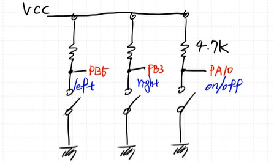

# 버튼 여러개 추가하기

**BTN 구성품 추가**  


> 위와 같은 BTN을 3개 추가한다.

**STM 32 와 연결**

각 버튼의 기능

  

**회로 구성**


pull up 저항을 달아서 BTN이 눌리지 않았을 때는 `1`이다.


**버튼 상태**  

```c
typedef enum{
	NO_ACT,
	ACT_PUSHED,
	ACT_RELEASED
}button_state_t;
```

Button을 추가하려고 보니 특정 BTN에 대한 함수로 작성되어 있다.

```c
void Button_Init(){
	GPIO_Init(GPIOC, 13, INPUT);
}
```

나는 범용적으로 Button Driver를 만들고 싶음  

***버튼 개수만큼 함수를 만들어도 되지만, 버튼이 아주 많아진다면 그때는 어떻게 해야할까?***


### 버튼 범용 드라이버 만들기
버튼을 범용적으로 사용하기 위해서는 구조체를 사용하여 버튼의 핀 번호와 GPIO 포트를 저장하고, 버튼의 상태를 관리하는 함수를 작성해야 한다.

이를 위해 우선 버튼 구조체를 만들자!

```c
typedef struct {
	GPIO_TypeDef *GPIOx;
	uint32_t pinNum;
	uint32_t prevState;
} Button_Handler_t;
```

버튼 초기화 함수 아래와 같이 작성한다.

```c
void Button_Init(Button_Handler_t *BTNx, GPIO_TypeDef *GPIOx, uint32_t pinNum){
	BTNx -> GPIOx = GPIOx;
	BTNx -> pinNum = pinNum;
	BTNx -> prevState = RELEASED;
	GPIO_Init(BTNx->GPIOx, BTNx->pinNum, INPUT);
}
```

버튼 상태를 읽어오는 함수는 아래와 같이 작성한다.
```c
button_state_t Button_GetState(Button_Handler_t *BTNx){
	uint32_t curState;
	curState= GPIO_ReadPin(BTNx-> GPIOx, BTNx-> pinNum);

	//처음 누른 경우
	if ((BTNx -> prevState == RELEASED) && (curState == PUSHED)){
		delay(2); //debounce
		BTNx -> prevState = PUSHED;
		return ACT_PUSHED;
	} else if ((BTNx -> prevState == PUSHED) &&(curState == RELEASED)){
		delay(2); //debounce
		BTNx->prevState = RELEASED;
		return ACT_RELEASED;
	}
	return NO_ACT;
}
```