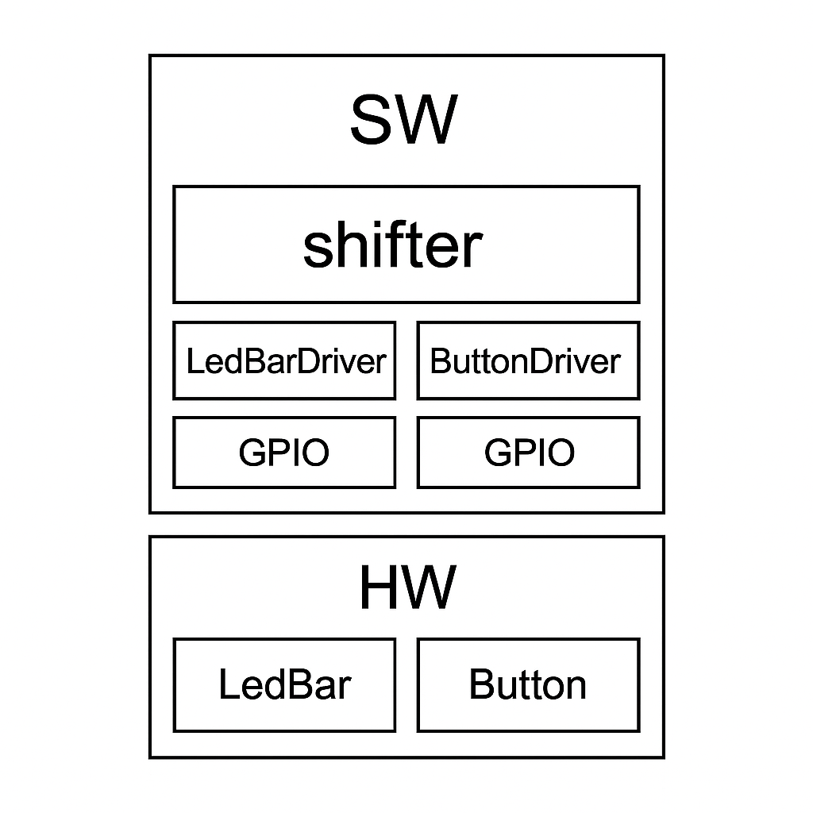

# GPIO 버튼 추가하기
>
> 기존의 LED Shifter 기능에서 BTN 기능을 추가하여 BTN을 누르면 LED가 반대 방향으로 SHIFT 하도록 한다.

**Schematic**  

  

- C언어 코드만으로는 edge detect 하는게 없다
  - C언어로 CLK edge 동기화를 할 수 없으니까

기존에 구현했던건 버튼을 누르고 있을 때 LED가 멈추는 문제가 있었음  
-> 이렇게하면 안된다함

Application에서 바로 GPIO(Interface)로 접근하는건 지양해야한다.  

- GPIO는 하드웨어에 가까운 부분이기 때문에, Application에서 직접 접근하는건 좋지 않다  g
- 단지 Driver만 수정하면 되는 것이 Interface까지 수정해야되어 번거로워진다.  
  

**인접한 Layer를 통해 메시지를 송수신해야한다**  
Application에서 인접한 Layer는 Driver이다.  

인터넷에 'software stack' 검색  

- 예시  
      
  Application에서 바로 MAC이나 PHY에 접근하지 않는다.

---

## SW Stack Layer 하나 더 추가

`ap_main` 만들기

- `main.c`의 기능

    `system` 초기화,

    `application` 실행 기능 외에는 고려하지 않는다.

### SW stack

SW Stack 구조

    +------------------------+
    |         SW            |
    |  +-----------------+  |
    |  |     main        |  |
    |  |  +-----------+  |  |
    |  |  |Application|  |  |
    |  |  +-----------+  |  |
    |  |  |  driver   |  |  |
    |  |  +-----------+  |  |
    |  |  | Interface |  |  |
    |  |  +-----------+  |  |
    |  +-----------------+  |
    +-----------------------+

    +----------------------+
    |         HW           |
    +----------------------+

이렇게 만들어야 재사용성이 좋다.

### 여기서 BTN 기능 추가를 고려해보자

**BTN 기능 추가를 위한 SW Stack**  



**BTN(Push Switch, Tact Switch)**  
Schematic으로 우리가 가진 BTN이 HW적으로 어떤 형태인지 알 수 있음

  

BTN이 Pullup 되어있다.

- BTN이 눌리지 않은 상태, `3.3V`
- BTN이 눌린 상태, `0V`

이상적으로 0 또는 1로 변화하면 완벽하지만 노이즈가 껴서 Chattering(Bounce) 현상이 발생한다.

  

이러한 Noise 또한 고려하면서 코드를 짜야한다. (debounce 코드를 작성해야한다)

**버튼의 상태를 받고 싶음**
`Button_GetState()` : 버튼의 상태를 받아오는 함수

**GPIO READ 함수 수정**

```c
uint32_t GPIO_ReadPin(GPIO_TypeDef *GPIOx, uint32_t pinNum){
    return ((GPIOx -> IDR & (1U << pinNum))? 1:0); //0이면 0이나가고, 0이 아닌 값이면 1이나간다
}
```

**Button Get State  함수**

```c
button_state_t Button_GetState(){
 static uint32_t prevState = RELEASED; //전원을 처음에 넣으면 초기값이 HIGH
 uint32_t curState;
 curState= GPIO_ReadPin(GPIOC, 13);

 //처음 누른 경우
 if ((prevState == RELEASED) && (curState == PUSHED)){
  prevState = PUSHED;
  return ACT_PUSHED;
 } else if ((prevState == PUSHED) &&(curState == RELEASE)){
  prevState = RELEASED;
  return ACT_RELEASED;
 }
 return NO_ACT;
}
```

static 변수로 선언한 이유 -> Scope를 벗어나도 메모리 공간이 반환되지 않는다.  
메모리 재할당을 안하니 이전 값이 계속 유지된다.  

**BTN의 상태**  

1. Button Normal 상태: RELEASED(`1`) 상태  
2. Button Push: PUSHED(`0`) 상태

**BTN 구성품 추가**  


> 위와 같은 BTN을 3개 추가한다.


