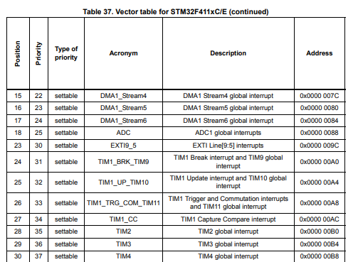

### 왜 FND가 끊기면서 출력될까?
[기존의 FND Driver 코드](../0619/Src/driver/FndController/fnd.c)

- `delay()` 함수로 인한 동기화 (blocking) 문제

    `delay()`가 system을 blocking 하기에 FND가 끊기면서 출력되는 현상이 발생함  

 

**코딩할 때 non-blocking 방식(비동기 방식)으로 작성해야한다**

 

> **Timer Interrupt**를 사용하자!

 

## 객체 개념
> SW는 객체처럼 생각해야한다.

기능을 모듈화하고, 캡슐화하여 생각하자

**"객체 처럼 생각한다"**

각각의 기능이나 데이터를 독립적인 객체로 보고, 각 객체들이 서로 상호작용하여 전체 시스템을 구성한다.

**"모듈화"**

프로그램을 여러 개의 작은 단위(모듈)로 나누어,
각 모듈이 어떤 기능을 담당하게 한다.

**"캡슐화"**

 객체 내부의 데이터와 기능을 외부에서 직접 접근하지 못하게 감추고, 필요한 기능만 외부에 공개한다.

## Caller와 Callee

> **Caller**: 함수를 호출하는 쪽  
    **Callee**: 함수를 호출받는 쪽

---

## Interuupt Service Routine (ISR)
Interrupt가 발생하면 PC가 정해진 ISR로 이동하여 해당 ISR을 실행한다.   
(이때 기존 PC는 스택에 저장된다.)

이후 ISR이 끝나면 스택에 저장된 PC로 돌아가서 기존에 수행하던 명령을 수행한다.

### NVIC(Nested Vectored Interrupt Controller)
STM32의 ISR   

**Nested** : 중첩된 인터럽트가 가능하다.
(인터럽트가 발생하고 여기서 또 다른 인터럽트가 발생할 수 있다.)

**Vectored** : 인터럽트 벡터 테이블을 사용하여 각 인터럽트에 대한 ISR의 주소를 저장한다.

**ISR Vector Table**

    ex) TIM 인터럽트가 발생하면 PC는 위 명시되어있는 주소로 즉시 이동

vector 들은 연속된 메모리 공간에 저장되어 있으며 이름이 정해져있다.

