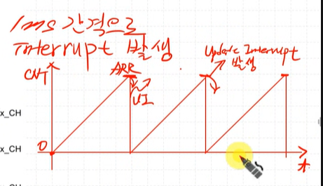

# FND Driver 만들기


***Timer가 `1ms`마다 인터럽트를 발생시켜 해당 인터럽트마다 FND를 갱신하는 구조로 작성하자***


    1. Timer Interrupt를 이용하여 1ms 간격으로 동작시키자
    2. ISR에서 FND를 갱신하는 코드를 작성하자


Interrupt 처리를 위해 NVIC를 사용해야한다.

이를 위해 다음 헤더파일을 가져오자


## 목표
### FND Driver의 Main Data
```c
#include "FND.h"

uint16_t fndDispNum =0; //fnd에 출력되는 display data

```

 * data 중심적으로 생각하자.
 * `fndDispNum` data를 FND에 출력하는 것만 고민하자

### function  

fndDisp를 write, read, display 했으면 좋겠다!

```c
void FND_WriteData(){
	fndDispNum = data;
}

uint16_t FND_ReadData(){
	return fndDispNum;
}

void FND_DispData(){
	//인터럽트가 발생하면 한 자리씩 출력한다.
}
```

## TIM 추가
interrupt를 발생시키기 위해 TIM을 추가하자


**TIM2 사용**  


### TIM Register


- **prescaler가 16**:   
	sysclock이 16MHz 일때, clock이 16이 들어오면 tick 1개가 나간다.  

- **counter Reigster** :   
	tick을 세는 애  

- **ARR Register** :  
	Auto Reload Register로, ARR 값과 CNT 값이 같아지면 CNT가 0으로 변경된다.
-> update Interrupt가 발생


**구조**  


sysClock(16MHz)가 PSC(Prescaler)로 들어온다.  



CNT가 증가하다가 ARR과 같아지면 UI(Update Interrupt)가 발생한다.

> 1ms마다 인터럽트를 발생시키려면?
>> PSC를 16으로 설정하면 1MHz,   
	ARR을 1000으로 설정하면 1000Hz가 된다.
	(1kHz 단위의 인터럽트 발생)

	- CNT 증가 속도: 1Mhz 마다 CNT가 1씩 증가한다.
	- CNT가 1000에 도달하면 UI 발생

***"1MHz / 1000 = 1ms" 마다 인터럽트가 발생한다.***


**Counter Enable 설정하기**  


**Interrupt Enable 설정하기**  


**Interrupt Vector 저장되어 있는 곳**

  

위 경로에 `TIM2_IRQHandler`가 정의되어 잇다.  


따라서 아래와 같이 TIM2 인터럽트 발생시 FND를 갱신하도록하게 한다.

```c
void TIM2_IRQHandler(void){
	FND_DispData();
}
```


**ver1. TIM2 Interrupt Handler 사용하여 FND 켜기**
```c
/*
 * ap_main.c
 *
 *  Created on: Jun 19, 2025
 *      Author: kccistc
 */

#include "ap_main.h"

Button_Handler_t hBtnLeft;
Button_Handler_t hBtnRight;
Button_Handler_t hBtnOnOff;

enum {
   LEFT,
   RIGHT,
   OFF
};

void TIM2_IRQHandler(void){
	FND_DispData();
	TIM_ClearUIF(TIM2);
}

int ap_main()
{
   uint8_t data = 1;
   uint16_t counter =0;
   int led_state = OFF;
   while(1)
   {
	  FND_WriteData(counter++);
      switch (led_state)
      {
      case LEFT:
         if (Button_GetState(&hBtnRight) == ACT_RELEASED) led_state = RIGHT;
         else if (Button_GetState(&hBtnOnOff) == ACT_RELEASED) led_state = OFF;
         data = (data << 1) | (data >> 7);
         LedBar_Write(data);
         break;
      case RIGHT:
         if (Button_GetState(&hBtnLeft) == ACT_RELEASED) led_state = LEFT;
         else if (Button_GetState(&hBtnOnOff) == ACT_RELEASED) led_state = OFF;
         data = (data >> 1) | (data << 7);
         LedBar_Write(data);
         break;
      case OFF:
         if (Button_GetState(&hBtnLeft) == ACT_RELEASED) led_state = LEFT;
         else if (Button_GetState(&hBtnRight) == ACT_RELEASED) led_state = RIGHT;
         data = (data >> 1) | (data << 7);
         LedBar_Write(0x00);
         break;
      }
	  delay(300);
   }
   return 0;
}

void ap_init()
{
   SystemClock_Init();   // led clock 설정
   LedBar_Init(); // led pin 설정
   Button_Init(&hBtnLeft, GPIOB, 5);
   Button_Init(&hBtnRight, GPIOB, 3);
   Button_Init(&hBtnOnOff, GPIOA, 10);
   FND_Init();
   TIM_Init(TIM2, 16-1, 1000-1);
   TIM_CntStart(TIM2);
   TIM_UIEnable(TIM2);
   NVIC_EnableIRQ(TIM2_IRQn);

   //TIM5는 interrupt안걸고 count만 할거
   TIM_Init(TIM5, 16000-1, 0xffffffff);
   SysTick_Init(TIM5);
   SysTick_Start();
}
```

**ver2.delay 없이 출력하기 위함**
```c
/*
 * ap_main.c
 *
 *  Created on: Jun 19, 2025
 *      Author: kccistc
 */

#include "ap_main.h"

Button_Handler_t hBtnLeft;
Button_Handler_t hBtnRight;
Button_Handler_t hBtnOnOff;

enum {
   LEFT,
   RIGHT,
   OFF
};

void TIM2_IRQHandler(void){
	FND_DispData();
	TIM_ClearUIF(TIM2);
}

int ap_main()
{
   uint8_t data = 1;
   uint16_t counter =0;
   int led_state = OFF;

   uint32_t prevCounterTime =0;

   while(1)
   {
	   if(getTick() - prevCounterTime >= 16000000){
		   prevCounterTime = getTick();
		   FND_WriteData(counter ++);
	   }
   }
   return 0;
}

void ap_init()
{
   SystemClock_Init();   // led clock 설정
   LedBar_Init(); // led pin 설정
   Button_Init(&hBtnLeft, GPIOB, 5);
   Button_Init(&hBtnRight, GPIOB, 3);
   Button_Init(&hBtnOnOff, GPIOA, 10);
   FND_Init();
   TIM_Init(TIM2, 16-1, 1000-1);
   TIM_CntStart(TIM2);
   TIM_UIEnable(TIM2);
   NVIC_EnableIRQ(TIM2_IRQn);

   //TIM5는 interrupt안걸고 count만 할거
   TIM_Init(TIM5, 16000-1, 0xffffffff);
   SysTick_Init(TIM5);
   SysTick_Start();
}
```
