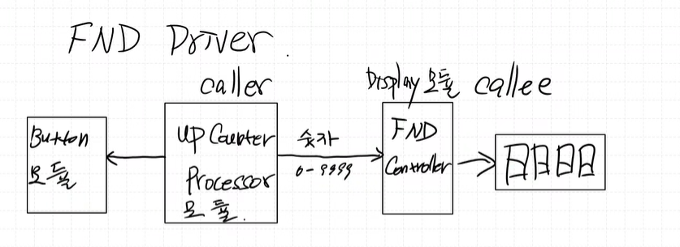

# FND Controller 

[기존의 FND Driver 코드](../0619/Src/driver/FndController/fnd.c)

### 왜 FND가 끊기면서 출력될까?

- `delay()` 함수로 인한 동기화 (blocking) 문제

    `delay()`가 system을 blocking 하기에 FND가 끊기면서 출력되는 현상이 발생함  

 

**코딩할 때 non-blocking 방식(비동기 방식)으로 작성해야한다**

 

> **Timer Interrupt**를 사용하자!

 

---

## 1. FND Driver 만들기

## 객체 개념
> SW는 객체처럼 생각해야한다.

기능을 모듈화하고, 캡슐화하여 생각하자

**"객체 처럼 생각한다"**

각각의 기능이나 데이터를 독립적인 객체로 보고, 각 객체들이 서로 상호작용하여 전체 시스템을 구성한다.

**"모듈화"**

프로그램을 여러 개의 작은 단위(모듈)로 나누어,
각 모듈이 어떤 기능을 담당하게 한다.

**"캡슐화"**

 객체 내부의 데이터와 기능을 외부에서 직접 접근하지 못하게 감추고, 필요한 기능만 외부에 공개한다.

## Caller와 Callee

> **Caller**: 함수를 호출하는 쪽  
    **Callee**: 함수를 호출받는 쪽