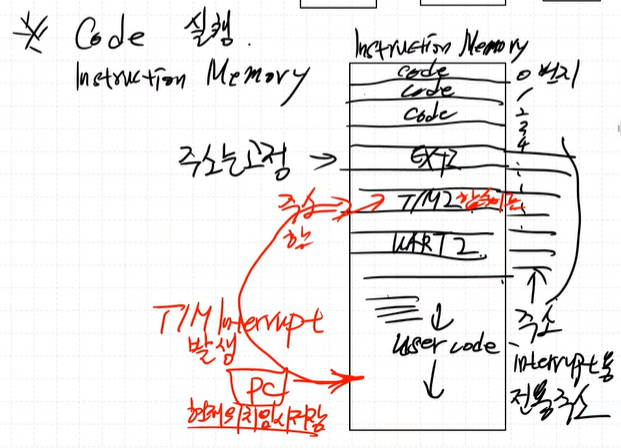
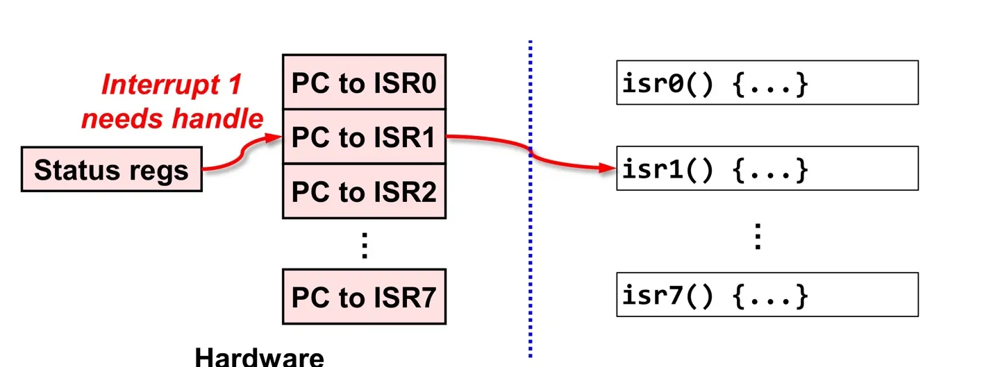

### Interrupt Handling

**Instruction Memory 구성**  

- 초기번지 : 초기 스택포인터, ISR vecotr table 등
- 중간번지 : ISR 함수들
- 나머지 : user code  

> 
main 함수에서 인터럽트 발생 시, ISR vector table로 이동 후 해당 Interrupt 함수로 이동한다.

### NVIC란?
NVIC란 Nested Vectored Interrupt Controller의 줄임말로 Cortex-M MCU 내부에서 인터럽트를 받아들이고 처리하기 위해 사용되는 인터럽트 컨트롤러를 말한다.