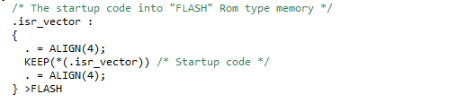
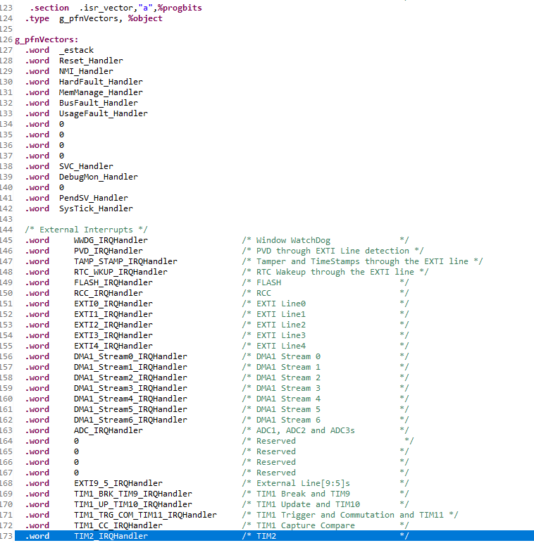
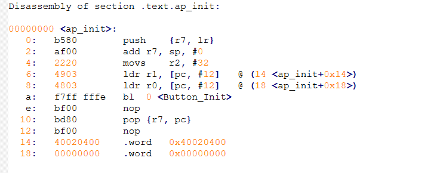

# 링커 스크립트 까보기

## `SECTIONS`

object 파일 내부 section 정보를 memory에 할당한다.

SECTIONS 순서대로 메모리를 할당한다.

아래 영역들은 순서대로 FLASH 메모리에 저장된다.

### 1. `.isr_vector`

ISR_Vector 는 FLASH 메모리 제일 첫번째에 저장되고, 
(해당 정보는   에 정의되어있다.)  

### 2. `.text`

    *(.text)           /* .text sections (code) */
    *(.text*)          /* .text* sections (code) */
    *(.glue_7)         /* glue arm to thumb code */
    *(.glue_7t)        /* glue thumb to arm code */
    *(.eh_frame)

이런 애들이 들어간다는 거임

### 3. `.rodata`

### 4. `.data`

    .data :
    {
        . = ALIGN(4);
        _sdata = .;        /* create a global symbol at data start */
        *(.data)           /* .data sections */
        *(.data*)          /* .data* sections */
        *(.RamFunc)        /* .RamFunc sections */
        *(.RamFunc*)       /* .RamFunc* sections */

        . = ALIGN(4);
        _edata = .;        /* define a global symbol at data end */

    } >RAM AT> FLASH

이렇게 돼있는 애들은 RAM영역에도, FLASH 영역에도 들어간다. (전역변수이면서 초기화된 변수들)

### 5. `.bss`

해당 영역은 RAM에 저장된다.

## `ENTRY(Reset_Handler)`

프로그램의 시작점

> **Reset Handler는 어디에?**  
  
`startup_stm32f411retx.s`에 존재

### `RESET_Handler`

프로그램 시작점
> 프로그램을 시작하거나, reset을 누르면 여기서 시작한다.

    Reset_Handler:  
    ldr   sp, =_estack    		 /* set stack pointer */

`estack`은 RAM의 가장 꼭대기 주소.  
이를 sp 에 저장한다.  
*(RISC-V 할때도 ROM 0번지 인덱스에 sp 에 값을 강제로 넣어주었다.)*

따라서 sp가 RAM에 꼭대기주소에서 시작하게된다.

    /* Call the clock system initialization function.*/
    bl  SystemInit   
클럭 초기화를 하는 코드이다.

    /* Copy the data segment initializers from flash to SRAM */  
    ldr r0, =_sdata
    ldr r1, =_edata
    ldr r2, =_sidata
    movs r3, #0
    b LoopCopyDataInit

`.data` section을 초기화하는 코드이다.

    CopyDataInit:
    ldr r4, [r2, r3]
    str r4, [r0, r3]
    adds r3, r3, #4

    LoopCopyDataInit:
    adds r4, r0, r3
    cmp r4, r1
    bcc CopyDataInit

flash 초기값을 RAM으로 copy

    /* Zero fill the bss segment. */
    ldr r2, =_sbss
    ldr r4, =_ebss
    movs r3, #0
    b LoopFillZerobss

    FillZerobss:
    str  r3, [r2]
    adds r2, r2, #4

    LoopFillZerobss:
    cmp r2, r4
    bcc FillZerobss
`.bss` section, RAM을 0 값으로 초기화

    /* Call the application's entry point.*/
    bl  main

그러고나서 이제 `main`함수를 call한다.

### Interrupt Vector Table
       .section  .isr_vector,"a",%progbits
            .word     TIM2_IRQHandler                   /* TIM2 */                   

