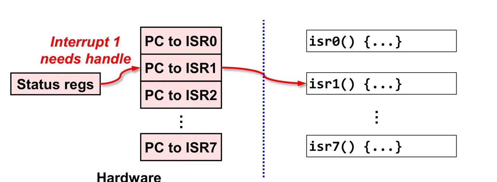

### 시계 + StopWatch 모듈 구성

- 정확한 시간: Timer/Counter Peripheral(주변장치)
  - 1ms마다 Interrupt 발생 (HW적으로 Interrupt 발생)
  - main에서 실행하다가 Interrupt 발생 시 ISR()로 Jump 한다.
  - Interrupt가 처리되면 다시 main으로 복귀한다.

### Interrupt Handling

**Instruction Memory 구성**  

- 초기번지 : 초기 스택포인터, ISR vecotr table 등
- 중간번지 : ISR 함수들
- 나머지 : user code  

> 
main 함수에서 인터럽트 발생 시, ISR vector table로 이동 후 해당 Interrupt 함수로 이동한다.

