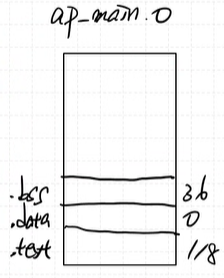

# 시계 + StopWatch 모듈 구성

## 정확한 시간은 어떻게 구현할까?

Timer/Counter Peripheral(주변장치)  

- 1ms마다 Interrupt 발생 (HW적으로 Interrupt 발생)
- main에서 실행하다가 Interrupt 발생 시 ISR()로 Jump 한다.
- Interrupt가 처리되면 다시 main으로 복귀한다.

**인터럽트 핸들링 개념**  
[인터럽트 핸들링](./Interrupt_Handling.md)  

**컴파일하기위한 프로그램 설치**  
[컴파일하기위한 프로그램 설치](./Complie_Program.md)

**컴파일과정**  

## FSM

## 환경구성
이제 Empty Project 말고 STM32CubeIDE에서 제공하는 걸 이용해서 개발을 진행한다.  

### 1. RCC 설정  

- HSE를 사용
- HSE를 8MHz로 설정

HSI: 16MHz 로 고정 (내부 클럭)
HSE: 외부 클럭 (8MHz, 우리가 사용하는 보드 외부 클럭은 8MHz)

해당 clock이 PLL 회로로 들어가 클럭을 100MHz로 뻥튀기한다.

HCLK이 APB Prescaler를 거쳐 Peripheral Clock이 된다.  
- Timer는 100MHz로 설정된다.  

### 2. Debuging 설정
Debuging 용 Wire를 Serial Wire로 설정한다.  

### 3. GPIO 설정
다음과 같이 GPIO를 설정한다.  
  

설정된 모습  

### 4. Timer 설정
다음과 같이 Timer를 설정한다.  
  
Timer Interrupt를 활성화하기위해 NVIC를 활성화한다.  
  

### 5. project manager 설정
code generator에서 Generate peripheral initialization as a pair of '.c/.h' files per peripheral를 선택한다.  
-> 관련 파일이 각각 따로 만들어져 보기 편하다고 한다.  
  

다했으면 톱니바퀴 아이콘을 눌러서 프로젝트를 생성한다.  
  

# 프로젝트 Layer
  

HAL Driver:
MCU의 주변장치를 제어하는 등의 동작은 HAL 레벨에서 이루어진다.
이를 위해 HAL 레벨에는 여러 개의 파일이 있는데, 이 파일의 묶음을 HAL Driver라고 한다.

**우리가 만들 프로젝트의 Layer**  

## 생성된 파일들

  

`stm32f4xx_it.c` 인터럽트 핸들링을 위한 소스파일   
`stm32f4xx_hal_msp.c` HAL 레벨에서 MCU의 주변장치를 제어하기 위한 소스파일  
`stm32f4xx_hal_conf.h` HAL 레벨에서 MCU의 주변장치를 제어하기 위한 설정 파일  

## HAL에 정의된 함수들

**HAL_TIM_PeriodElapsedCallback()**  

주기적으로 호출되는 콜백함수.

- 콜백이란?  
main함수에서 다른 함수를 부르는형태를 **콜백**이라고 한다.

## compile 하면 생기는 파일

`~.elf` 파일이 보드에 다운로드 된다.  
  

`make clean`으로 기존에 만들어진 실행관련 파일을 다 지우자

`make all`을 하면 컴파일을 진행한다.

**그 다음 분석하기**  

**object file의 size**를 확인가능하다.

    arm-none-eabi-size ap_main.o

(text, data, bss 영역의 크기를 확인할 수 있다.)

>   
ap_main.o가 위와같은 section으로 나뉘어져있다.

**assmebly어 생성하는 명령어**

    arm-none-eabi-objdump -d ap_main.o > ap_main.d

`ap_main.d` 파일을 열어보면 어셈블리어로 변환된 코드를 볼 수 있다.  

특징을 살펴보면 함수 이름 옆에 주소가 다 0으로 되어있다.  

> 이유는 아직 컴파일러가 최적화를 하지 않았기 때문이다.

**`ap_main.nm` 파일 생성**

    arm-none-eabi-nm -nS ap_main.o > ap_main.nm

`ap_main.nm`파일이 생성되었다!

ap_main.nm 파일은 심볼을 출력하는 파일이다.
