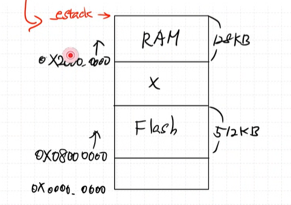

## STM32 컴파일 과정

    .c → (전처리) → .i → (컴파일) → .s → (어셈블) → .o → (링킹) → .elf

**1. 전처리 (Preprocessing)**  
- 생성파일 : `*.i`
-  `#include, #define`을 해석하고, 헤더 파일을 붙여넣는 과정  

**2. 컴파일 (Compiling)**
- 생성파일 : `*.s`	
- 전처리된 코드를 어셈블리어로 변환하는 과정

**3. 어셈블 (Assembling)**	
- 생성파일: `*.o`	
- 어셈블리어를 기계어로 바꾸는 과정, 오브젝트 파일 생성

 assembling 단계에서 쓸 수 있는 명령어들 

    
   
    
 size 분석 

**object file의 size**를 확인가능하다.

    arm-none-eabi-size ap_main.o

disassembly해서 사람이 볼 수 있도록하는 파일

    
    arm-none-eabi-objdump -d ap_main.o > ap_main.d

**4. 링킹 (Linking)**	
- 생성파일: `*.elf`	
- 여러 오브젝트 파일을 합쳐서 최종 실행 파일 생성  

        main.c       ap_main.c       Button.c       FND.c       ...
        │             │               │             │
        ▼             ▼               ▼             ▼
        main.o      ap_main.o       Button.o       FND.o       ...
        └──────────┬───────────────┬──────────────┘
                   │               │
                   ▼               ▼
                   [    링커 (Linker)    ]
                    │               │
                    ▼               ▼
                stopwatch.elf (실행 파일)
    
    ***링커가 주소할당을 해준다***  

    > 링커는 RAM, FLASH, ROM 등의 size가 어떻게 할당되어있는지 알고 주소할당을 수행하는걸까?

    

    Linker는 **Memory Section 정보가 있는 Script 파일**을 참고하여 주소할당을 수행한다.

    해당 파일을 `Linker Secript`파일이라하며 다음과 같이 존재한다.  
    

    위 파일을 까보면,
        
        MEMORY
        {
        RAM    (xrw)    : ORIGIN = 0x20000000,   LENGTH = 128K
        FLASH    (rx)    : ORIGIN = 0x8000000,   LENGTH = 512K
        }
    
    RAM 시작주소가 0x2000~, 길이가 128K등 임을 알 수 있다.

        /* Highest address of the user mode stack */
        _estack = ORIGIN(RAM) + LENGTH(RAM); /* end of "RAM" Ram type memory */

    `estack`은 RAM의 꼭대기 주소이다.
    
    - RAM 시작주소 + RAM 크기

    

    makefile에서 아래 처럼 정의된 것을 볼 수 있다.
    

    `-T"C:\Users\kccistc\STM32\20250623_TimeWatch_StopWatch\STM32F411RETX_FLASH.ld"`   
    Linker Script 이걸 참고해라!

**5. 후처리 (옵션)**	
- 생성파일: `*.bin, *.hex`	
- STM32에 업로드 가능한 바이너리 혹은 HEX 파일 생성

---
## 링커 스크립트란?

***링커에게 메모리를 어떻게 배치할지 알려주는 설계도***

컴파일러는 그냥 `.o` 파일을 만들 뿐임(section을 나누기만 한다.)

링커는 `.o`만 보고는 어디에 무엇을 배치할지 모른다.

따라서 링커 스크립트를 보고 메모리 주소를 배정한다.

***링커 스크립트는 section들의 주소 범위를 링커에게 알려준다.***

---

# 링커 스크립트 까보기

## `SECTIONS`

object 파일 내부 section 정보를 memory에 할당한다.

SECTIONS 순서대로 메모리를 할당한다.

아래 영역들은 순서대로 FLASH 메모리에 저장된다.

### 1. `.isr_vector`

ISR_Vector 는 FLASH 메모리 제일 첫번째에 저장되고, 
(해당 정보는   에 정의되어있다.)  

### 2. `.text`

    *(.text)           /* .text sections (code) */
    *(.text*)          /* .text* sections (code) */
    *(.glue_7)         /* glue arm to thumb code */
    *(.glue_7t)        /* glue thumb to arm code */
    *(.eh_frame)

이런 애들이 들어간다는 거임

### 3. `.rodata`

### 4. `.data`

    .data :
    {
        . = ALIGN(4);
        _sdata = .;        /* create a global symbol at data start */
        *(.data)           /* .data sections */
        *(.data*)          /* .data* sections */
        *(.RamFunc)        /* .RamFunc sections */
        *(.RamFunc*)       /* .RamFunc* sections */

        . = ALIGN(4);
        _edata = .;        /* define a global symbol at data end */

    } >RAM AT> FLASH

이렇게 돼있는 애들은 RAM영역에도, FLASH 영역에도 들어간다. (전역변수이면서 초기화된 변수들)

### 5. `.bss`

해당 영역은 RAM에 저장된다.

## `ENTRY(Reset_Handler)`

프로그램의 시작점

> **Reset Handler는 어디에?**  
  
`startup_stm32f411retx.s`에 존재

### `RESET_Handler`

프로그램 시작점
> 프로그램을 시작하거나, reset을 누르면 여기서 시작한다.

    Reset_Handler:  
    ldr   sp, =_estack    		 /* set stack pointer */

`estack`은 RAM의 가장 꼭대기 주소.  
이를 sp 에 저장한다.  
*(RISC-V 할때도 ROM 0번지 인덱스에 sp 에 값을 강제로 넣어주었다.)*

따라서 sp가 RAM에 꼭대기주소에서 시작하게된다.

    /* Call the clock system initialization function.*/
    bl  SystemInit   
클럭 초기화를 하는 코드이다.

    /* Copy the data segment initializers from flash to SRAM */  
    ldr r0, =_sdata
    ldr r1, =_edata
    ldr r2, =_sidata
    movs r3, #0
    b LoopCopyDataInit

`.data` section을 초기화하는 코드이다.

    CopyDataInit:
    ldr r4, [r2, r3]
    str r4, [r0, r3]
    adds r3, r3, #4

    LoopCopyDataInit:
    adds r4, r0, r3
    cmp r4, r1
    bcc CopyDataInit

flash 초기값을 RAM으로 copy

    /* Zero fill the bss segment. */
    ldr r2, =_sbss
    ldr r4, =_ebss
    movs r3, #0
    b LoopFillZerobss

    FillZerobss:
    str  r3, [r2]
    adds r2, r2, #4

    LoopFillZerobss:
    cmp r2, r4
    bcc FillZerobss
`.bss` section, RAM을 0 값으로 초기화

    /* Call the application's entry point.*/
    bl  main

그러고나서 이제 `main`함수를 call한다.

### Interrupt Vector Table
       .section  .isr_vector,"a",%progbits
            .word     TIM2_IRQHandler                   /* TIM2 */                   

