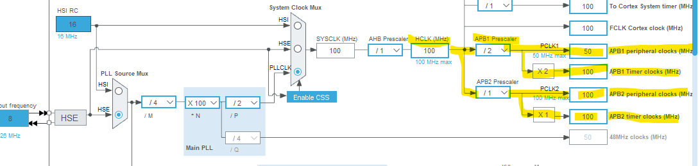
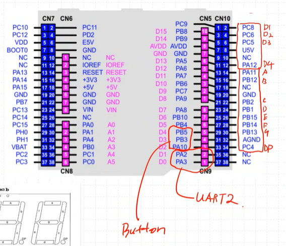
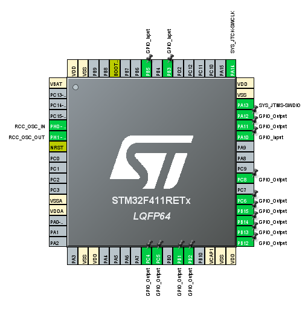
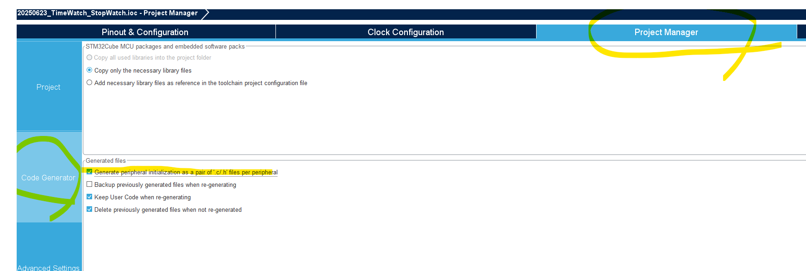

## 환경구성

이제 Empty Project 말고 STM32CubeIDE에서 제공하는 걸 이용해서 개발을 진행한다.  

### 1. RCC 설정  

- HSE를 사용
- HSE를 8MHz로 설정

HSI: 16MHz 로 고정 (내부 클럭)
HSE: 외부 클럭 (8MHz, 우리가 사용하는 보드 외부 클럭은 8MHz)

해당 clock이 PLL 회로로 들어가 클럭을 100MHz로 뻥튀기한다.

HCLK이 APB Prescaler를 거쳐 Peripheral Clock이 된다.  
- Timer는 100MHz로 설정된다.  

### 2. Debuging 설정
Debuging 용 Wire를 Serial Wire로 설정한다.  

### 3. GPIO 설정
다음과 같이 GPIO를 설정한다.  
  

설정된 모습  

### 4. Timer 설정
다음과 같이 Timer를 설정한다.  
  
Timer Interrupt를 활성화하기위해 NVIC를 활성화한다.  
  

### 5. project manager 설정
code generator에서 Generate peripheral initialization as a pair of '.c/.h' files per peripheral를 선택한다.  
-> 관련 파일이 각각 따로 만들어져 보기 편하다고 한다.  
  

다했으면 톱니바퀴 아이콘을 눌러서 프로젝트를 생성한다.  
  
