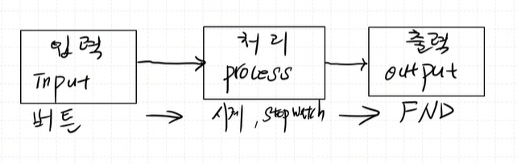
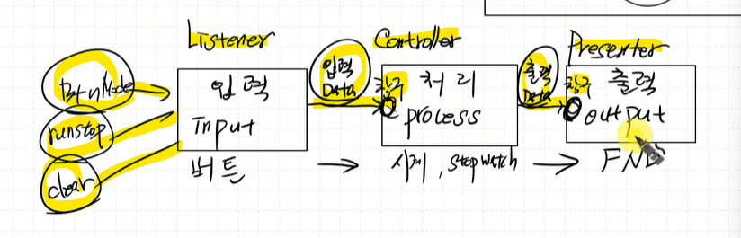

## 결합력이 느슨한 코드를 만들어야한다.

[기존 버전](./TimeWatch_StopWatch_v00/Core/ap/ap_main.c)

***좋은 코드는 결합력이 느슨한 코드가 좋은 코드다***

> **결합력이 강하다**  
한 구현 코드안에서 어떤 것을 변경해야할 경우   
수정되야 할 코드가 많은 코드 


> **결합력이 약하다(느슨하다)**  
구현 코드 안에서 어떤 것을 변경해야할 경우  
수정되야 할 코드가 적은 코드


***소프트웨어 구조를 잘 생각하자!***

현재 구현된 기존 버전 또한 결합력이 강한 편이다.

---

## 입력/처리/출력 부분을 분리해서 생각하자.



입력 단에서 처리단으로 `입력 Data` 만을 던져주고,  
처리 단에서 출력단으로 `출력 Data`만을 던져준다.


이를 위해,
먼저 `입력`, `처리`, `출력` 부분을 나누자.

### 창구 역할이 필요하다.
처리단의 입력 Data를 처리하는 창구,  
출력단에 출력 Data를 처리하는 창구가 필요하다.

하나의 창구만 존재하도록 한다.



- Listner : 입력에 대한 부분 담당
  - 입력이 들어오면 Controller로 던진다.

**Sequence Diagram**  


구조체를 이용하여 구조를 통합하자.  
공통된 구조체를 Listner와 Controller에 포함시켜야한다.  


### Model

메시지 정의 파일

`Listner`, `Controller`, `Presenter` 등은 각각의 객체이다.

***팀 프로젝트할때도 sequence diagram을 그리고 역할을 나누면된다***

# Listner 만들기

Listner는 버튼이 눌렸는지 안눌렸는지만 계속 확인한다.

> 버튼이 눌렸다면 해당 데이터를 가공해서 Controller에게 보내준다.

```c
#include "Listner.h"

void Listner_Execute(){
	Listner_CheckButton();
}


void Listner_CheckButton(){
	if (Button_GetState(&hbtnMode) == ACT_RELEASED){
		inputData.id = MODE;
		inputData.data = ACT;
		Controller_SetInputData(inputData);
	}else if (Button_GetState(&hBtnRunStop) == ACT_PUSHED){
		inputData.id = RUN_STOP;
		inputData.data = ACT;
		Controller_SetInputData(inputData);
	}else if (Button_GetState(&hBtnClear) == ACT_PUSHED){
		inputData.id = CLEAR;
		inputData.data = ACT;
		Controller_SetInputData(inputData);
	}
}


```

# UART 연결하기


UART2를 사용하면 된다.

Connectivity>USART2>Asynchronous
