# LCD Driver 만들기

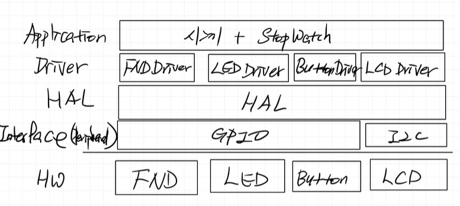  

쪽보드가 있어 I2C 통신으로 제어 가능한 LCD  

LCD Driver 만들고 app 에서 띄우는 것이 목표  

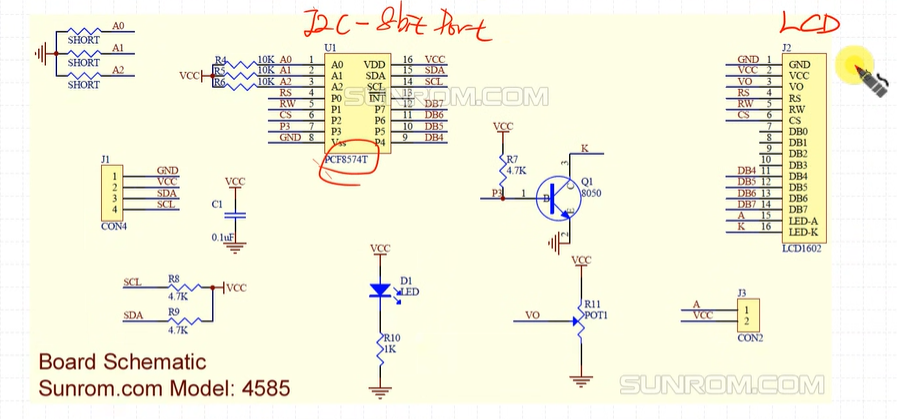

## pcf8574 

LCD 쪽보드에 달려있는 chip   
I2C Interface에서 data가 들어오면 8bit port로 내보내준다.

### Slave Address  

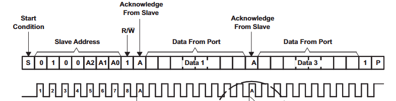

Slave Address: 0100_`A2`_`A1`_`A0`_`R/W`  

**A2,A1,A0 은 VCC로 Pull up 되어있다.**  
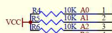

***따라서 slave Address는 010_0111 -> `0x27`***

A0,A1,A2를 short 시켜서 HW 주소를 변경 가능하다.  

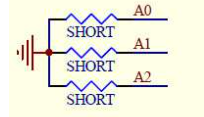

### Write mode  
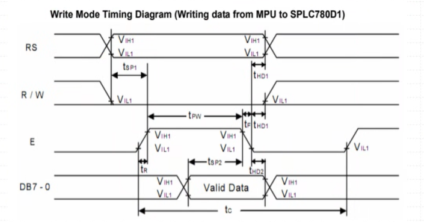
- **RS :**
    
    Data/Register
    Valid Data 값이
    - Data: 글자인지
    - Register: 내부 명령어인지  

    를 의미 

    `RS: 0`: command (명령어 모드)  
    `RS= 1`: data (글자 모드)

    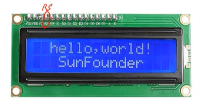  

- **R/W :**  
    `1` : Read
    `0` : Write

- **E :**  
    Enable이 Falling edge일때 LCD에 Data가 적용된다.

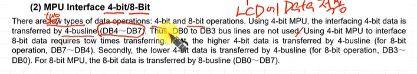

two type data operation이 존재 (4bit, 8bit)

- 4bit mpu to interface 사용시 2번 전송이 요구됨
    - 첫번째: 상위 4bit, 두번째: 하위 4bit 전송

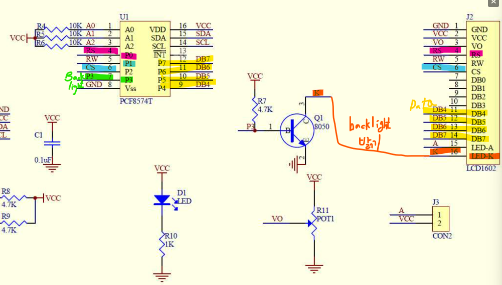  

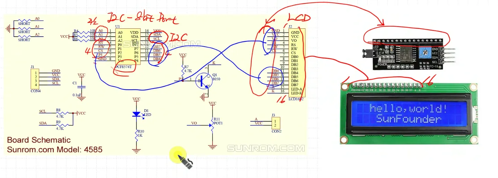

## I2C 연결하기
ioc 파일에서 설정해주기

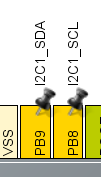