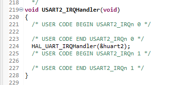
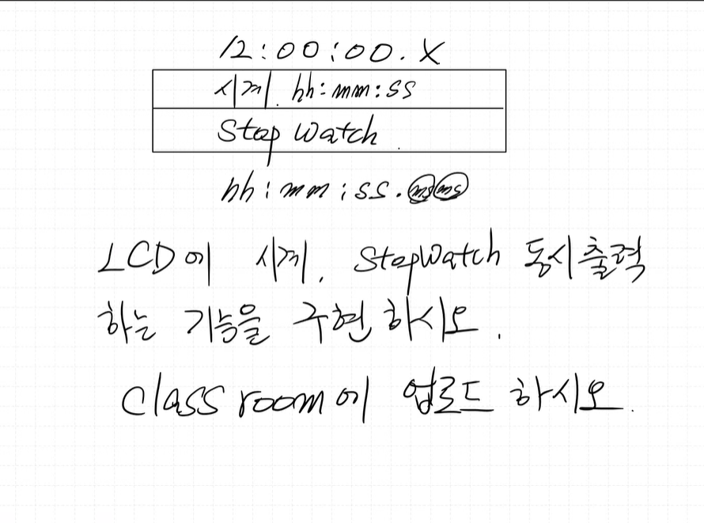

### 어제와 같은 listner, controller, presenter로 나눠 개발하는 것의 장단점 (FrameWork 형태로 만드는 것)

장점: 큰 프로젝트에서의 개발 속도가 빨라진다. 생성, 추가, 삭제가 원활해진다.

단점: 초기 세팅에 시간이 많이 걸린다.

***결합력이 느슨한 코드를 만들어야한다***


# UART 추가하기

UART 기능 추가를 위해 `Listener.c`에 UART Receive 함수를 추가하자.

```c
void Listener_CheckUart(){
	inputData_TypeDef inputData;

	uint8_t rcvData = 0;

	HAL_UART_Receive(&huart2, &rcvData, 1, 1000);
    
    ...
}
```

`ap_main.c`의 while 문에 계속 돌아가는 `Listener_Execute()` 함수를 추가하자.

```c
void Listener_Execute()
{
    Listener_CheckButton();
    Listener_CheckUart();
}
```


## 문제: UART 수신 시 시스템 Block 

`	HAL_UART_Receive(&huart2, &rcvData, 1, 1000);` 에서 CPU가 1초동안 block 되는 문제가 있다.

> 해결방법
UART 수신되었을 때만 처리하기 위해 UART 수신 되었을 때 인터럽트를 걸도록 한다.


USART2 NVIC Setting에서 Interrupt 를 enable 해주자.


(`NVIC`: Nested Vectored Interrupt )


Interrupt 관련 코드는 `stm32f4xx_it.c`에 존재


새로 생긴 `USART2_IRQHandler`


HAL Driver를 통해 Interrupt를 처리한다.


`HAL_UART_IRQHandler`는 아래 파일에 존재.


  
  

`HAL_UART_RxCpltCallback` 를 가져다 쓸 예정  

  

## 해결 1 : 초보적인 방법

`Listener.c`에 `Listener_UartCallBack()` 추가

```c
void Listener_Init()
{
	Button_Init(&hBtnMode, GPIOB, GPIO_PIN_5);
	Button_Init(&hBtnRunStop, GPIOB, GPIO_PIN_3);
	Button_Init(&hBtnClear, GPIOA, GPIO_PIN_10);
	HAL_UART_Receive_IT(&huart2, &rcvData, 1); //인터럽트 enable
}
```
`HAL_UART_Receive_IT(&huart2, &rcvData, 1);` interrupt를 enable 해주는 함수.

1byte 들어올때마다 interrupt를 걸리게해라

***Receive Interrupt를 발생시켜라***

`Listener_Init`이 실행된 후, UART Interrupt가 걸렸다면 `Listener_UartCallBack` 함수가 실행되고, 다음과 같이 재 enable을 해주어야 지속하여 Interrupt를 걸 수 있다.


```c
void Listener_UartCallBack(){
	uartRcvFlag =1;
	HAL_UART_Receive_IT(&huart2, &rcvData, 1); //interrupt re enable
}
```

## 해결 2 : 원형 큐 만들기

**FIFO(First In Frist Out)**

### 상태 

1. `EMPTY` 상태

    **초기값** :
    `front` =0, `rear` = 0

    **의미**:  
    메모리 공간이 비어있다.  
    `empty` 상태  

        empty = (front == rear)


2. `FULL` 상태

        full = (front == (rear + 1))   


### enqueue/dequeue

1. `enqueue`
    
- 상태 확인  
    - Full이면 저장 X  
    - Full이 아니면 저장 O

- 저장 시
    - 메모리에 저장
    - rear index 1 증가 % 4 


2. `dequeue`
- 상태 확인
    - Empty가 아니면 dequeue O
    - Empty이면 dequeue X

- dequeue 시
    - front index 의 메모리 위치 출력
    - front index 1 증가 % 4


extern을 쓰면 전역 변수를 여러 파일에서 접근할 수 있습니다.
즉, main.c에서 선언하지 않고도, uart.c에 있는 uartRxQue를 직접 사용할 수 있게 됩니다.

👉 한 파일에서 큐를 생성하고, 다른 파일에서 동일한 큐를 사용할 수 있음


# void pointer


# 숙제

