# MVC

이런형태로 구현하는걸 MVC 패턴이라고한다.

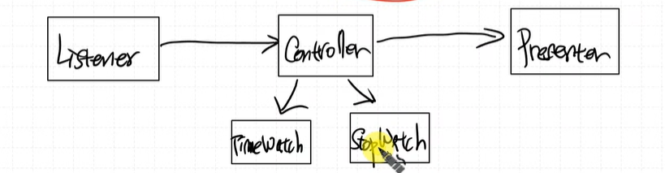  


timewatch, stopwatch 입장에서는 출력을 신경쓰지 않을 수 있도록 위와 같이 구현하자.

# 부저 추가하기


## 타이머

**PWM을 만들어보자.**


`CNT`를 중심으로 생각하자

***주파수 변경하기***


ARR(TOP) 값을 조절하여 주파수를 변경하자.

***PWM 적용을 위해 Duty Cycle을 변경할 수 있다.***  
임의의 기준값을 설정한 후, 기준값 보다 CNT 값이 작으면 출력을 `HIGH`, 크다면 `LOW`로 설정해주면 된다.

> **Capture Compare Register**  
이떄 임의의 기준은 `CCR(Capture Compare Register)` 가 된다.

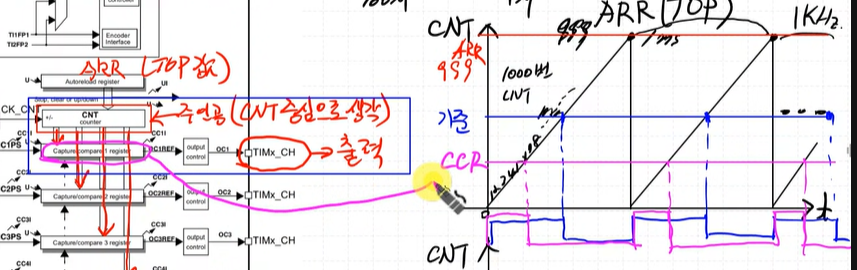


- **PWM**
    - **주파수:** `ARR`
    - **Duty Cycle:** `CCR`


***High 신호를 길게하고 싶다면 `CCR`을 올리면 된다.***

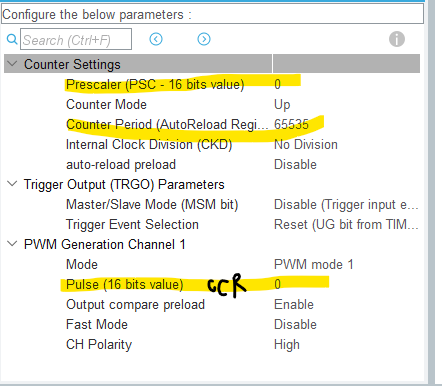  

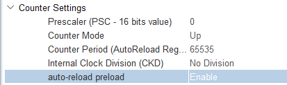

Auto-reload preload 값을 `Enable`로 설정해놓으면, ARR 값 변경 시 ARR 값이 CNT 값과 같아진 이후에 ARR 값을 바꾸기 때문에 CNT 값이 ARR 값과 같아지는 타이밍을 놓쳐 CNT 값이 overflow되는 현상을 방지 가능하다.


### 타이머 추가하기
TIM3, TIM_CHANNEL_1

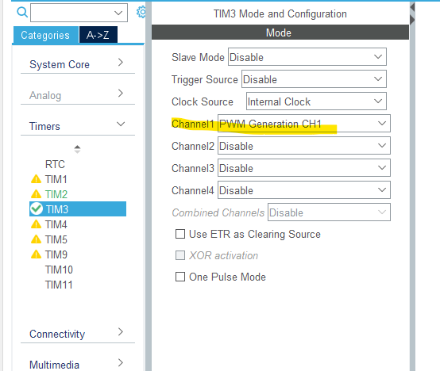  
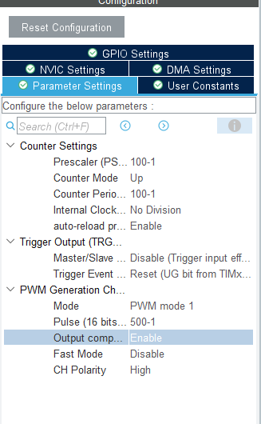  

```c
//ap_main.c
int ap_main()
{
	HAL_TIM_PWM_Start(&htim3, TIM_CHANNEL_1);
}
```


### SW Stack  

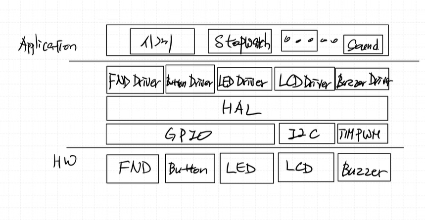


# DC Motor 추가

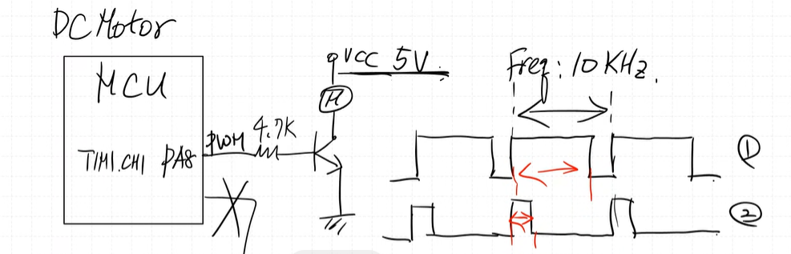

- 주파수 고정 (10kHz)
- duty cycle 변경 (0~100%)
- Dc Motor Driver (초기화, 속도조절, Start, Stop)

# 온습도센서 추가

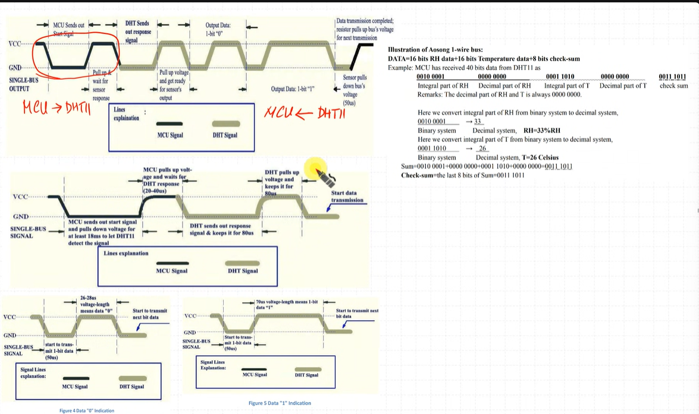

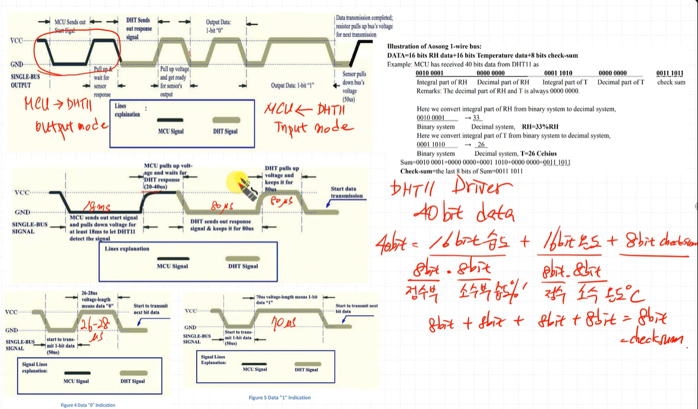

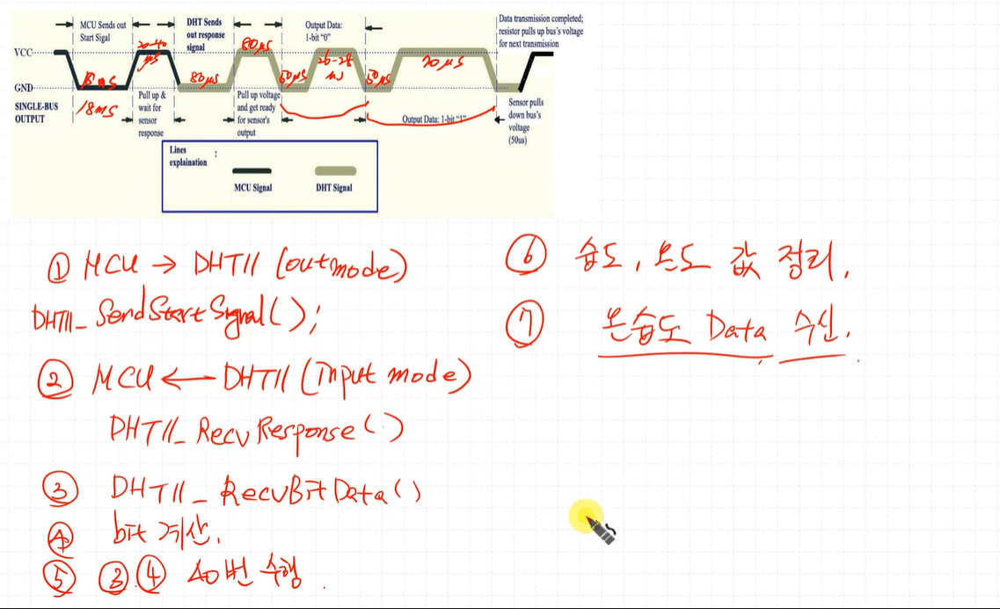

# 발표 자료에 들어가야할 내용
- Object Diagram  

    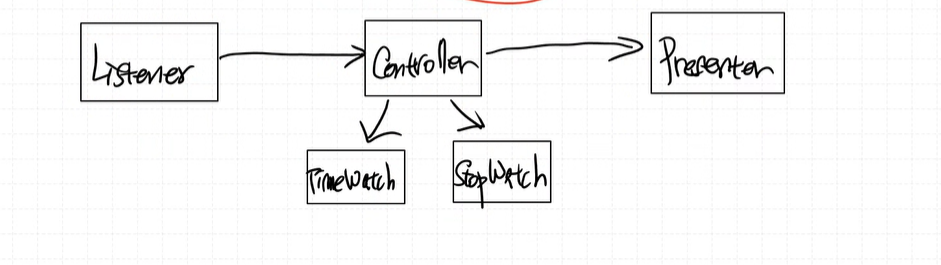

    이 네모가 object
- SW Stack

- Sequence Diagram

    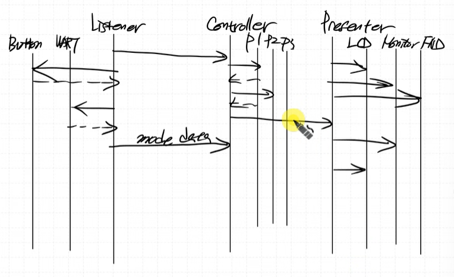


