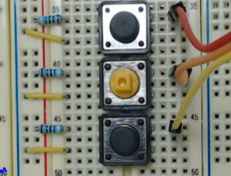
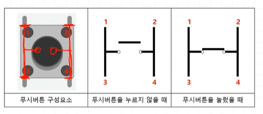
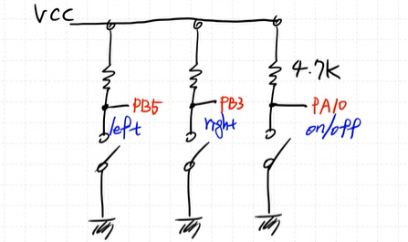

# BTN LED 제어

[GPIO구조](./GPIO.md)

### BTN을 사용하기 위해 아래와 같이 pin을 mapping 하자

  
BTN은 총 3개를 사용한다.

회로는 다음과 같이 구성한다.  

  

pull up 저항을 달아서 BTN이 눌리지 않았을 때는 `1`이다.

- `PB5` : BTN 1
- `PB3` : BTN 2
- `PB10`: BTN 3

