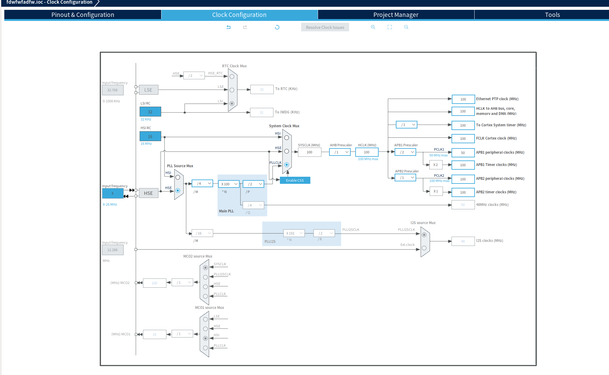

# BTN LED 제어

[GPIO구조](./GPIO.md)

## CLK Configuration 설정



## BTN을 사용하기 위해 아래와 같이 pin을 mapping 하자

  
BTN은 총 3개를 사용한다.


회로는 다음과 같이 구성한다.  

  

pull up 저항을 달아서 BTN이 눌리지 않았을 때는 `1`이다.


- `PB5` : BTN 1
- `PB3` : BTN 2
- `PB10`: BTN 3


## BTN 함수 정의

### `Btn_Handler_t` 구조체를 다음과 같이 정의한다.  

```c
typedef struct{
	GPIO_TypeDef *GPIOx;
	uint16_t pinNum;
	uint32_t prevState;
}Btn_Handler_t;
```

### BTN 상태 정의

**BTN의 물리적 상태**
- BTN이 눌리지 않았을 때: `RELEASED`    
- BTN이 눌렸을 때: `PUSHED`    

> BTN 제어를 위해서는 debounce, 눌렀을 때 작동되도록 할 지, 눌렀다 땠을 때 작동되도록 할지를 고민해야한다.

이를위해, BTN의 상태를 다음과 같이 정의한다.  

**BTN 상태**  

- `NO_ACT`: 이전 상태도 `RELEASED`, 현재 상태도 `RELAESED`인 경우  
- `ACT_PUSHED`: 이전 상태는 `RELAESED`, 현재 상태는 `PUSHED`인 경우  
- `ACT_RELEASED`: 이전 상태는 `PUSHED`, 현재 상태는 `RELEASED`인 경우  

debounce를 고려하여 `HAL_Delay`를 삽입하자

**1. BTN INIT 함수**

```c
void Button_Init(Btn_Handler_t *hbtnx,GPIO_TypeDef *GPIOx, uint16_t pinNum, uint32_t prevState){
	hbtnx -> GPIOx  = GPIOx;
	hbtnx -> pinNum = pinNum;
	hbtnx -> prevState = RELEASED;
}
```
BTN 구조체를 생성하여 정보를 저장한다.  
핀 할당이나 input, output 설정은 cube ide에서 수행하니 고려하지않는다.

**2. BTN GetState 함수**  

BTN의 상태 (`NO_ACT`, `ACT_PUSEHD`, `ACT_RELEASED`) 를 받아오는 함수이다.  

```c
Btn_State_t Button_GetState(Btn_Handler_t *hbtnx){
	uint32_t curState;
	curState = HAL_GPIO_ReadPin(hbtnx ->GPIOx, hbtnx->pinNum);
	if(hbtnx->prevState == RELEASED && curState == PUSHED){
		HAL_Delay(2);
		hbtnx->prevState = PUSHED;
		return ACT_PUSHED;
	}else if (hbtnx -> prevState == PUSHED && curState == RELEASED){
		HAL_Delay(2);
		hbtnx->prevState = RELEASED;
		return ACT_RELEASED;
	}
	return NO_ACT;
}
```

## LEDbar 제어함수 만들기
```c
#include "ledbar.h"

typedef struct{
	GPIO_TypeDef *GPIOx;
	uint32_t pinNum;
}LedBar_TypeDef;


LedBar_TypeDef ledBar[8] = {
		{GPIOA, GPIO_PIN_0},
		{GPIOA, GPIO_PIN_1},
		{GPIOA, GPIO_PIN_4},
		{GPIOB, GPIO_PIN_0},
		{GPIOC, GPIO_PIN_1},
		{GPIOC, GPIO_PIN_0},
		{GPIOC, GPIO_PIN_2},
		{GPIOC, GPIO_PIN_3}
};

void LedBar_Write(uint8_t data){
	for(int i=0; i<8; i++){
		if ((data & (1<<i))==0 ){
			HAL_GPIO_WritePin(ledBar[i].GPIOx, ledBar[i].pinNum, RESET);
		}else{
			HAL_GPIO_WritePin(ledBar[i].GPIOx, ledBar[i].pinNum, SET);
		}
	}
}
```


# MVP 패턴 설계 (Model-View-Presenter)

## MVP Seqeunce Diagram

```
# MVP Sequence Diagram (With Function Names)

Listener       Controller            Presenter
   |                |                    |
   |  Listener_Execute()                 |
   |  └─ Listener_CheckButton()        |
   |--------------->|                    |
   |                |  Controller_Execute()  
   |                |  └─ Controller_Mode()  
   |                |--------------->     |
   |                |                     |  Presenter_Execute()
   |                |                     |  └─ RUN_LED()
   |                |                     |---------------> 
   |                |                     |  HAL_Delay(100ms)
   |                |                     |
   |<----------------------------------------------|
                       (메인 루프 반복)

```


# Delay 대신 Interrupt 고민하기

`TIM2`를 이용하자

`PSC` : 100-1  
`ARR` : 1000-1  

## 타이머 인터럽트 시작하는 방법

```c
//stm32f4xx_hal_tim.c
HAL_TIM_Base_Start_IT(&htim2);
```

타이머 인터럽트를 위와 같이 실행하고 나면,

```
타이머 주기 도달
      ↓
타이머가 하드웨어적으로 IRQ 발생
      ↓
TIMx_IRQHandler() 자동 호출
      ↓
HAL_TIM_IRQHandler() 자동 호출
      ↓
HAL_TIM_PeriodElapsedCallback() 호출
      ↓
사용자가 작성한 코드 실행
```


## `HAL_TIM_PeriodElapsedCallback()` 정의하기

```c
void HAL_TIM_PeriodElapsedCallback(TIM_HandleTypeDef *htim)
{
    if(htim->Instance == TIM2)  // TIM2에서 발생한 인터럽트인지 확인
    {
        // 여기에 내가 원하는 인터럽트 동작 작성
    }
}
```

