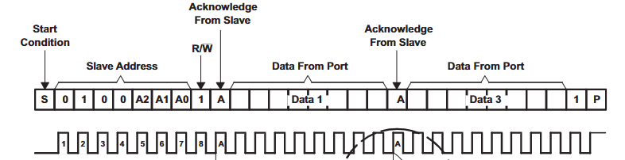
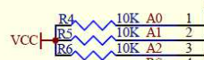
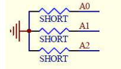
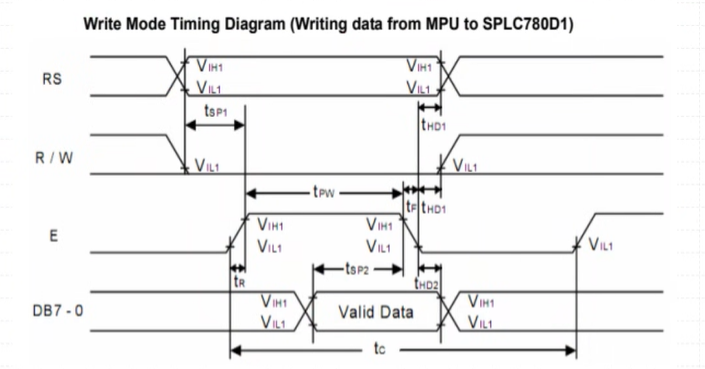
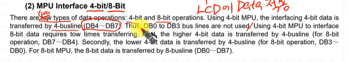
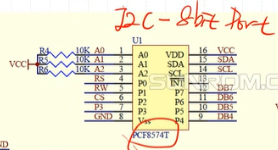
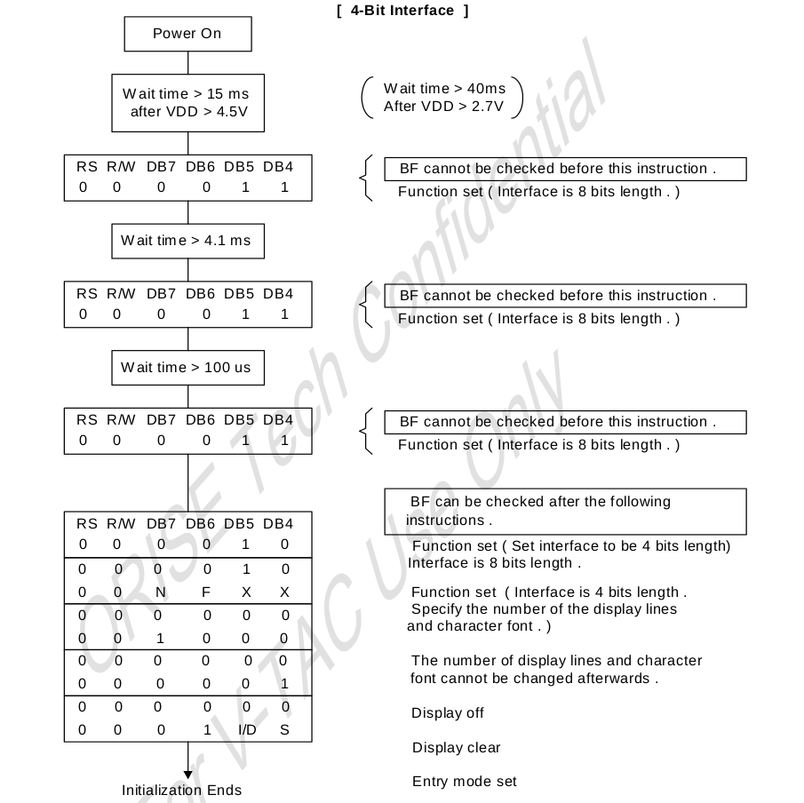
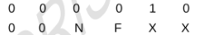
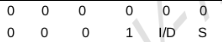

# LCD
## pcf8574

LCD 쪽보드에 달려있는 chip

  

### Slave Address  

Slave Address: 0100_`A2`_`A1`_`A0`_`R/W`  

**A2,A1,A0 은 VCC로 Pull up 되어있다.**  
  
***따라서 slave Address는 010_0111 -> `0x27`***

A0,A1,A2를 short 시켜서 HW 주소를 변경 가능하다.  

## SPLC780D1
### Slave Register

**1. RS**
- `1`: Data Register
- `0`: Instruction Register

**2. R/W**  
Selecting read or write actions
- `1`: Read
- `0`: Write

**3. E**  
Enable
- Falling edge 일때 LCD에 data가 적용된다.

**4. BL**  
LCD BackLigiht 키는 애

### MPU Interface 4bit/8bit

two type data operation이 존재 (4bit, 8bit)  

  

우리는 4bit mpu to interface (DB4~DB7)
- 4bit mpu to interface 사용시 2번 전송이 요구됨
    - 첫번째: 상위 4bit, 두번째: 하위 4bit 전송

***LCD는 쪽보드 `pcf8574`가 SDA pin을 통해 `lcdData`를 전달받은후 해당 lcdData를 LCD의 8개 line으로 뿌려준다.***

## Reset Function
전원이 켜지면, 아래의 initial instructions을 실행해야한다.

### 4bit Function Set

앞 4bit이 `2` 뒤 4bit이 `8`

    #define LCD_4BIT_FUNC_SET 0x28

- N:
    - `1`: Two-line display (***이거 선택***)
    - `0` : One-line display

- F:
    - `1`: 5 X 10 dots character font
    - `0`: 5 X 8 dots character font (***이거 선택***)
 
### LCD DISP OFF

    #define LCD_DISP_OFF 0x08

### LCD DISP CLEAR

    #define LCD_DISP_CLEAR 0x01

### LCD Entry Mode Set

    #define LCD_ENTRY_MODE_SET 0x06

- I/D(Increment/Decrement):
    - `1`: 데이터쓸때 커서가 오른쪽으로 이동 (***이거 선택***)
    - `0` : 데이터쓸때 커서가 왼쪽으로 이동

- S(Shift):
    - `1`: 데이터를 쓸 때 화면 자체가 같이 이동
    - `0`: 화면은 고정되고 커서만 이동 (***이거 선택***)

> 여기까지 설정되었다면 LCD BackLight를 ON 할 수 있다. (설정 전에 LCD BackLight를 켜면 안된다)

	LCD_sendData(LCD_DISP_ON);
    LCD_backLightOn();

